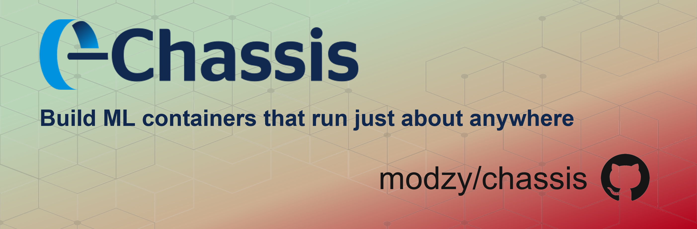
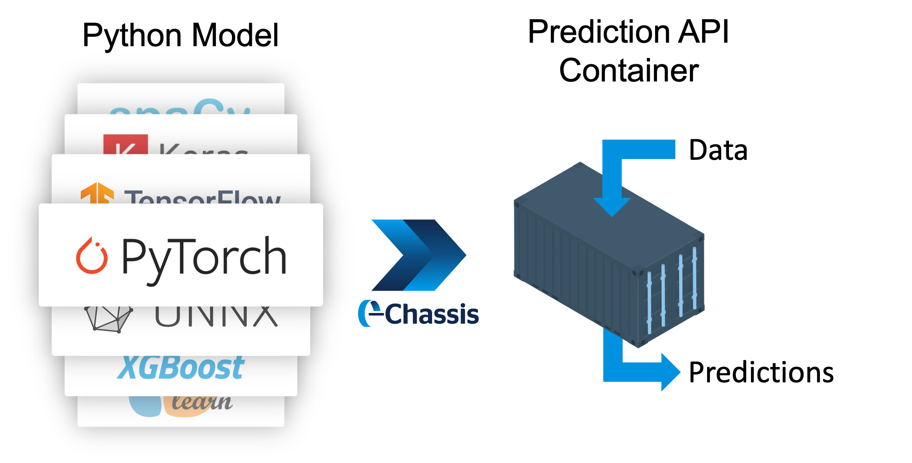

<div align="center">

<!--  -->



<h3 align="center">
  <a href="https://chassis.ml">Docs</a>
  <span> · </span>
  <a href="https://discord.gg/anSeEj8ARg">Discord</a> (#chassisml)
  <span> · </span>
  <a href="https://go.mlops.community/slack">Slack</a> (#chassis-model-builder)
  
</h3>

</div>

# What is Chassis?
<div align="center">

<!--  -->



<br>

</div>

Chassis is an open-source project that turns ML models into containerized prediction APIs in just minutes. We built this tool for Data Scientists, Machine Learning Engineers, and DevOps teams who need an easier way to automatically build containers out of *any* model and ship them to production.

Chassis picks up right where your training code leaves off and builds containers for a variety of target architectures. This means that after completing a single Chassis job, you can run your models in the cloud, on-prem, or on a fleet of edge devices (Raspberry Pi, NVIDIA Jetson Nano, Intel NUC, etc.).

## Benefits
<!-- JSDelivr -->
<!-- *  Turns models into containers, automatically -->
<!-- *  Exposes gRPC servers as easy-to-use APIs
*  Builds interoperable containers that can run on Kubernetes, Docker, KServe, and Modzy
*  Ships containers to Docker Hub or preferred registry
*  Natively compiles containers for both x86 and ARM processors
*  Includes GPU batch processing support
*  Great for edge AI with all dependencies bundled together -->

*  Turns models into containers, automatically
*  Exposes gRPC servers as easy-to-use APIs
*  Builds interoperable containers that can run on Kubernetes, Docker, KServe, and Modzy
*  Ships containers to Docker Hub or other preferred container registry
*  Natively compiles containers for both x86 and ARM processors
*  Includes GPU batch processing support
*  Great for edge AI with all dependencies bundled together

<!-- <br>

*  Turns models into containers, automatically
*  Exposes gRPC servers as easy-to-use APIs
*  Builds interoperable containers that can run on Kubernetes, Docker, KServe, and Modzy
*  Ships containers to Docker Hub or preferred registry
*  Natively compiles containers for both x86 and ARM processors
*  Includes GPU batch processing support
*  Great for edge AI with all dependencies bundled together

<br>

*  Turns models into containers, automatically
*  Exposes gRPC servers as easy-to-use APIs
*  Builds interoperable containers that can run on Kubernetes, Docker, KServe, and Modzy
*  Ships containers to Docker Hub or preferred registry
*  Natively compiles containers for both x86 and ARM processors
*  Includes GPU batch processing support
*  Great for edge AI with all dependencies bundled together -->

# Getting Started

## Installation
Install Chassis on your machine or in a virtual environment via [PyPi](https://pypi.org/project/chassisml/):

```bash
pip install chassisml
```

Check out our full [Getting Started](https://chassis.ml/getting-started/deploy-connect/) guide for more installation details.

## Quick Example
Follow this example to build your first container from a simple Scikit-learn classifier.

> **Note**: To follow along with the example code below, you must create a free [Docker Hub](https://hub.docker.com/signup) account if you do not already have one. We also recommend setting up a virtual environment to run the below code. Chassis currently supports Python 3.6 >.

Open a local Python environment (Jupyter notebook or preferred IDE), and install additional requirements.

```bash
pip install scikit-learn
```

Then, simply copy and execute this example code into your Python editor.
```python
import json
import pickle
import chassisml
import numpy as np

# load model
model = pickle.load(open("getting-started/model.pkl", "rb"))

# define process function
def process(input_bytes):
    inputs = np.array(json.loads(input_bytes))
    inference_results = model.predict(inputs)
    structured_results = []
    for inference_result in inference_results:
        structured_output = {
            "data": {
                "result": {"classPredictions": [{"class": str(inference_result), "score": str(1)}]}
            }
        }
        structured_results.append(structured_output)
    return structured_results

# connect to Chassis client
chassis_client = chassisml.ChassisClient("https://chassis.app.modzy.com/")

# create Chassis model
chassis_model = chassis_client.create_model(process_fn=process)

# test Chassis model
sample_filepath = 'getting-started/digits_sample.json'
results = chassis_model.test(sample_filepath)
print(results)

# publish model to Dockerhub
response = chassis_model.publish(
    model_name="My First Chassis Model",
    model_version="0.0.1",
    registry_user="<insert-Docker Hub username>",
    registry_pass="<insert-Docker Hub password>"
)

# wait for job to complete and print result
job_id = response.get('job_id')
final_status = chassis_client.block_until_complete(job_id)
print(final_status)
```

# Docs

📘 [Full Docs](https://chassis.ml)

☁️ [Full Install Tutorial](https://chassis.ml/getting-started/deploy-manual/)

🧑‍🏫 [Model Packaging Tutorial](https://chassis.ml/tutorials/ds-connect/)

Framework-specific examples:
|  |  |  |  |  |
|---|---|---|---|---|
| <!-- JSDelivr -->  [Pytorch](https://chassis.ml/how-to-guides/frameworks/#pytorch) | <!-- JSDelivr -->  [SciKit-Learn](https://chassis.ml/how-to-guides/frameworks/#scikit-learn) | <!-- JSDelivr -->  [ONNX](https://chassis.ml/how-to-guides/frameworks/#onnx) | <!-- JSDelivr -->   [Keras](https://chassis.ml/how-to-guides/frameworks/#tensorflow-keras) | <!-- JSDelivr -->   [Tensorflow](https://chassis.ml/how-to-guides/frameworks/#tensorflow-keras) |
| [spaCy](https://chassis.ml/how-to-guides/frameworks/#spacy) | <!-- JSDelivr -->   [Spark MLlib](https://chassis.ml/how-to-guides/frameworks/#spark-mllib) | [XGBoost](https://chassis.ml/how-to-guides/frameworks/#xgboost) | [LightGBM](https://chassis.ml/how-to-guides/frameworks/#lightgbm) | [Fastai](https://chassis.ml/how-to-guides/frameworks/#fastai) |
| [MXNet](https://chassis.ml/how-to-guides/frameworks/#mxnet) | [PMML](https://chassis.ml/how-to-guides/frameworks/#pmml) |  |  |  |

# Support

Join the `#chassisml` channel on [Modzy's Discord Server](https://discord.gg/eW4kHSm3Z5) where our maintainers meet to plan changes and improvements.

We also have a `#chassis-model-builder` Slack channel on the [MLOps.community Slack](https://go.mlops.community/slack)!


## Contributors

<!-- ALL-CONTRIBUTORS-LIST:START - Do not remove or modify this section -->
<!-- prettier-ignore-start -->
<!-- markdownlint-disable -->
<table>
  <tbody>
    <tr>
      <td align="center"><a href="https://github.com/bmunday3"><br /><sub><b>Bradley Munday</b></sub></a><br /><a href="https://github.com/modzy/chassis/commits?author=bmunday3" title="Code">💻</a> <a href="#ideas-bmunday3" title="Ideas, Planning, & Feedback">🤔</a> <a href="#maintenance-bmunday3" title="Maintenance">🚧</a> <a href="#question-bmunday3" title="Answering Questions">💬</a></td>
      <td align="center"><a href="https://github.com/caradoxical"><br /><sub><b>Seth Clark</b></sub></a><br /><a href="#content-caradoxical" title="Content">🖋</a> <a href="https://github.com/modzy/chassis/commits?author=caradoxical" title="Documentation">📖</a> <a href="#projectManagement-caradoxical" title="Project Management">📆</a></td>
      <td align="center"><a href="https://github.com/DataScienceDeconstructed"><br /><sub><b>Clayton Davis</b></sub></a><br /><a href="https://github.com/modzy/chassis/commits?author=DataScienceDeconstructed" title="Code">💻</a> <a href="https://github.com/modzy/chassis/commits?author=DataScienceDeconstructed" title="Documentation">📖</a> <a href="#ideas-DataScienceDeconstructed" title="Ideas, Planning, & Feedback">🤔</a> <a href="#projectManagement-DataScienceDeconstructed" title="Project Management">📆</a></td>
      <td align="center"><a href="http://n8mellis.net"><br /><sub><b>Nathan Mellis</b></sub></a><br /><a href="#ideas-n8mellis" title="Ideas, Planning, & Feedback">🤔</a> <a href="#infra-n8mellis" title="Infrastructure (Hosting, Build-Tools, etc)">🚇</a> <a href="https://github.com/modzy/chassis/commits?author=n8mellis" title="Code">💻</a></td>
      <td align="center"><a href="https://github.com/saumil-d"><br /><sub><b>saumil-d</b></sub></a><br /><a href="https://github.com/modzy/chassis/commits?author=saumil-d" title="Code">💻</a> <a href="https://github.com/modzy/chassis/commits?author=saumil-d" title="Documentation">📖</a> <a href="#tutorial-saumil-d" title="Tutorials">✅</a> <a href="#ideas-saumil-d" title="Ideas, Planning, & Feedback">🤔</a></td>
    </tr>
    <tr>
      <td align="center"><a href="https://github.com/lukemarsden"><br /><sub><b>lukemarsden</b></sub></a><br /><a href="https://github.com/modzy/chassis/commits?author=lukemarsden" title="Documentation">📖</a> <a href="#projectManagement-lukemarsden" title="Project Management">📆</a> <a href="#ideas-lukemarsden" title="Ideas, Planning, & Feedback">🤔</a> <a href="#talk-lukemarsden" title="Talks">📢</a> <a href="#video-lukemarsden" title="Videos">📹</a></td>
      <td align="center"><a href="https://carmilso.com"><br /><sub><b>Carlos Millán Soler</b></sub></a><br /><a href="https://github.com/modzy/chassis/commits?author=carmilso" title="Code">💻</a></td>
      <td align="center"><a href="https://www.linkedin.com/in/douglas-holman/"><br /><sub><b>Douglas Holman</b></sub></a><br /><a href="https://github.com/modzy/chassis/commits?author=DHolmanCoding" title="Code">💻</a></td>
      <td align="center"><a href="https://github.com/philwinder"><br /><sub><b>Phil Winder</b></sub></a><br /><a href="#ideas-philwinder" title="Ideas, Planning, & Feedback">🤔</a></td>
      <td align="center"><a href="https://github.com/sonejah21"><br /><sub><b>Sonja Hall</b></sub></a><br /><a href="#design-sonejah21" title="Design">🎨</a></td>
    </tr>
  </tbody>
</table>

<!-- markdownlint-restore -->
<!-- prettier-ignore-end -->

<!-- ALL-CONTRIBUTORS-LIST:END -->
