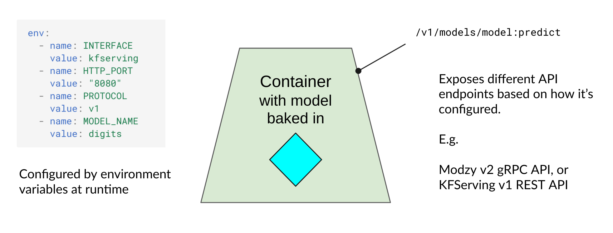

# Design & Architecture

Chassis makes it easy to create a deployable docker image from your trained ML model.

The idea behind this project is to provide Data Scientists with a way to package their models into a Docker image. This image will manage to build the inference service compatible with several common platforms for free.

* Build models directly into DevOps-ready container images for inference (using [MLflow](https://mlflow.org) under the hood)
* Supports parallel builds in Kubernetes jobs, using [Kaniko](https://github.com/GoogleContainerTools/kaniko), no Docker socket required!
* Generates [Open Model Interface](https://openmodel.ml) compatible images that are multi-purpose and portable, they work on multiple platforms: KFServing and Modzy
* Try the test drive today, then deploy our Helm chart to your K8s cluster to use it for real

At the moment, Chassis images are compatible with KFServing and Modzy gRPC. This means you can deploy your built image into these platforms once it has been built.

Deploy Chassis, send your model to it and start using the built container image to run inference on your data.

## Architecture

This diagram shows the overall architecture of the Chassis system:

{ style="border:20px solid white" }

This diagram zooms in on the generated container, showing the pluggable interface, configurable at runtime:

{ style="border:20px solid white" }