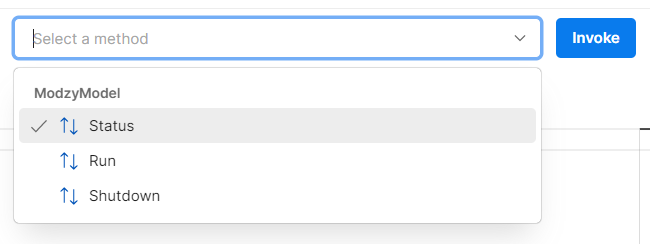

# Run Model in Postman

<!-- TODO: add link to google colab notebook -->

After building a container with Chassisml, there are several ways to interact with it: via [Modzy](https://www.modzy.com/try-free/), [KServe](https://kserve.github.io/website/0.8/), or locally on your machine. This tutorial demonstrates how to make API calls to a container locally using Postman.

!!! note
    To follow this tutorial, you do not need your own container as we provide an example Chassisml container for convenience. However, if you do you have your own model container, you can switch out the example container with your own.

## Getting started

### Install Required Dependencies

* Install [Docker](https://docs.docker.com/get-docker/)
    * Open a terminal on your machine, and try to run `docker ps`
        * If you get a permissions error, follow instructions [here](https://docs.docker.com/engine/install/linux-postinstall/)
* Install [Postman](https://www.postman.com/downloads/)
* Download [proto file](https://github.com/modzy/chassis/blob/main/service/flavours/mlflow/interfaces/modzy/protos/model2_template/model.proto)

### Download Sample Container

```bash
docker pull modzy/chassisml-image-classification
```

### Spin up Container

Before interacting with the container using Postman, we need to first spin up the container and port forward it to a port we will use in the local URL configuration in Postman.

```bash
docker run -p 5000:45000 -it modzy/chassisml-image-classification:latest
```

In this docker command, we use the following parameters:

* **-p**: Forwards the port serving the gRPC server inside the container (45000) to a local port (5000)
* **-it**: Runs container interactively, so you can see the logs from the container as you make API calls to it

To learn more, visit the [Docker run](https://docs.docker.com/engine/reference/run/) reference documentation.

After running the container, you should see this logs message printed to your terminal:

```
INFO:interfaces.modzy.grpc_model.src.model_server:gRPC Server running on port 45000
```

## Send gRPC Requests to Running Container

### Request Set Up

Once the container is running locally, open the Postman app. On the upper left part of the screen, select **New** and open **gRPC Request**.

{ style="border:20px solid white" }

Enter your local server URL into the first box.

{ style="border:20px solid white" }

In the second box, select the **Import protobuf definition from local file** and upload the [proto file](https://github.com/modzy/chassis/blob/main/service/flavours/mlflow/interfaces/modzy/protos/model2_template/model.proto) you downloaded during setup.

{ style="border:20px solid white" }

Give your protobuf a name and version.

{ style="border:20px solid white" }

The three remote procedure calls defined in the protobuf file (to which our Chassisml container adheres to) will appear in the **Select a method** dropdown.

{ style="border:20px solid white" }

We are now ready to invoke requests to the three remote procedure calls this container can respond to as defined in the model protobuf file.

### Invoke Methods

#### Status()

First, we will invoke the `Status()` method, which will execute any model instantiation required for model inference. 

Simply select the `ModzyModel / Status` option and click **Invoke**.

{ style="border:20px solid white" }

In the response section on the bottom of your screen, you should see the following information returned:

```json
{
    "status_code": 200,
    "status": "OK",
    "message": "Model Initialized Successfully.",
    "model_info": {
        "model_name": "MXNET MobileNet Image Classifiction",
        "model_version": "0.0.1",
        "model_author": "Chassis",
        "model_type": "grpc"
    },
    "description": {
        "summary": "Chassis model.",
        "details": "Chassis model.",
        "technical": "Chassis model."
    },
    "inputs": [
        {
            "filename": "input",
            "accepted_media_types": [
                "application/json"
            ],
            "max_size": "5M",
            "description": "Input file."
        }
    ],
    "outputs": [
        {
            "filename": "results.json",
            "media_type": "application/json",
            "max_size": "1M",
            "description": "Output file."
        }
    ],
    "resources": {},
    "timeout": {
        "status": "60s",
        "run": "60s"
    },
    "features": {
        "batch_size": 1
    }
}
```

The 200 `status_code` tells us the model was successfully spun up and instantiated. Notice the response also includes some metadata about our model.

#### Run()

Next, we will invoke the `Run()` method, which expects raw bytes as input to perform inference on, and in turn will respond with the model predictions.

To do so, first change the method from `ModzyModel / Status` to `ModzyModel / Run`.

{ style="border:20px solid white" }

As defined by the model protobuf file, this method expects a request that contains three inputs:

```proto
message RunRequest {
  repeated InputItem inputs     = 1;
  bool detect_drift             = 2;
  bool explain                  = 3;
}
```

Where the `InputItem` is defined as:

```proto
message InputItem {
  map<string, bytes> input      = 1;
}
```

Fortunately, Postman makes it very easy to create a properly-formatted input request message. At the bottom of the Request section, click **Generate Example Message** button.

{ style="border:20px solid white" }

Replace the example content in the "Message" box (right above **Generate Example Message** button) with this content:

```json
{
    "detect_drift": false,
    "explain": false,
    "inputs": [
        {
            "input": {"input": "base64-encoded-image"}
        }
    ]
}
```

**NOTE**: Before invoking the `Run()` method, you must first replace the contents of the "input" string with an actual raw byte representation of an image. For the sake of this tutorial, we did not paste the full base64 encoding of an image, but to replicate the results listed below, download this [image](https://github.com/modzy/chassis/blob/main/chassisml-sdk/examples/mxnet/data/dog.jpg) and upload it to this [base64 encoder](https://elmah.io/tools/base64-image-encoder/) to get the full encoding. Replace "base-64-encoded-image" with the base64 encoded representation of the image (wrapped in quotes). 

After pasting in the base64 equivalent of the image into the value string inside the request message, click **Invoke** to run a sample inference.

You should see the following JSON printed in the **Response** section.

```json
{
    "status_code": 200,
    "status": "OK",
    "message": "Inference executed",
    "outputs": [
        {
            "output": {
                "results.json": "eyJkYXRhIjp7InJlc3VsdCI6eyJjbGFzc1ByZWRpY3Rpb25zIjpbeyJjbGFzcyI6ImJveGVyIiwic2NvcmUiOjAuODE0MzAyNDQ0NDU4MDA3OH0seyJjbGFzcyI6ImJ1bGwgbWFzdGlmZiIsInNjb3JlIjowLjE2MjA1NTQ2MjU5ODgwMDY2fSx7ImNsYXNzIjoiU3RhZmZvcmRzaGlyZSBidWxsdGVycmllciwgU3RhZmZvcmRzaGlyZSBidWxsIHRlcnJpZXIiLCJzY29yZSI6MC4wMDYxOTQ1Nzg5NDkzNjIwMzk2fV19LCJleHBsYW5hdGlvbiI6bnVsbCwiZHJpZnQiOm51bGx9fQ=="
            },
            "success": true
        }
    ]
}
```

You will noticed the contents of the `output` object are also base64 encoded, as defined in the protobuf file. Decode the raw base64 string [here](https://www.base64decode.org/). The decoded result should look as follows: 

```json
{
    "data": {
        "result": {
            "classPredictions": [
                {
                    "class": "boxer",
                    "score": 0.8143024444580078
                },
                {
                    "class": "bull mastiff",
                    "score": 0.16205546259880066
                },
                {
                    "class": "Staffordshire bullterrier, Staffordshire bull terrier",
                    "score": 0.0061945789493620396
                }
            ]
        },
        "explanation": null,
        "drift": null
    }
}
```

In practice, encoding and decoding data is easy to do in your program of choice, so these manual steps normally would not be required in a production API application. However, to conveniently construct and test gRPC APIs in postman, these steps are required. 


#### Shutdown()

Lastly, invoke the `Shutdown()` method the same way you invoked the `Status()` method. This will shutdown the container running locally on your machine.

## Tutorial in Action

ADD VIDEO LINK


